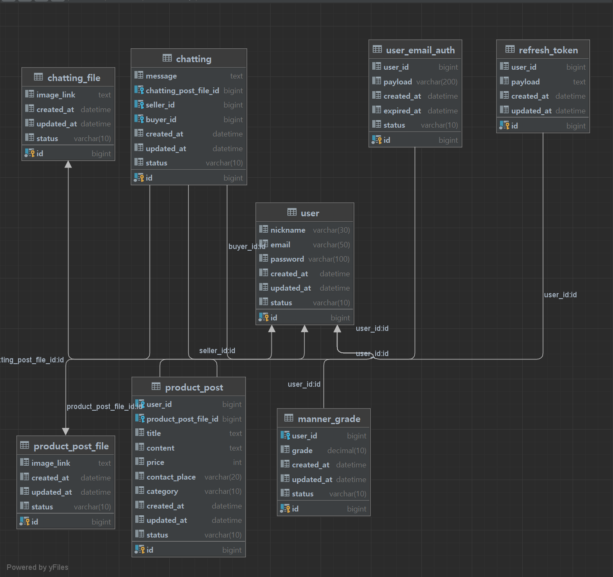

# 세부 기술스택

|프레임워크| DB 접근기술                |RDBMS|Storage|Deploy|Domain|ETC|
|---|------------------------|---|---|---|---|---|
|Java / Spring| Spring Data JPA   QueryDSL|MySQL|S3|EC2(Ubuntu 20.04, NGINX)|Route 53|SES|

---

# UML

---

# ERD (Ver. 220915)

---

# API 명세서 (Ver. 220915)

---

## 프로젝트간 개인 목표

[이전 프로젝트](https://github.com/uswLectureEvaluation/Backend-Remaster)에서 작성한 방식말고, 더 향상된 코드 작성을 위한 연습요소를 포함하기.

[스터디-자바와깐부맺기](https://github.com/Be-GGanboo-With-Java)에서 학습한 내용 적극적으로 반영해보기.

QueryDSL, JWT Filter 적용, Spring Security 로 인증 인가 관리

Clean Code Convention